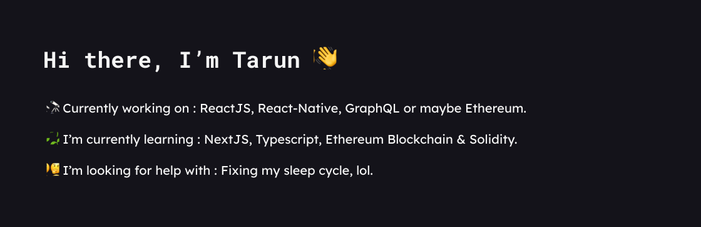

```javascript
// More about me
const tarun= {
    askMeAbout: ["Web Dev", "Ethereum dApp dev", "random-tech-stuff"],
    technologies:{
        fronEnd: ["ReactJS", "Redux", "recoil-js"],
        backEnd: ["Nodejs", "ExpressJS", "Graphql"],
        database: ["MongoDB", "Firebase", "MySQL"],
        blockchain:["Ethereum", "Solidity", "IPFS"]
    },
    loves:["javascript", "React", "coffee", "mountains"]
}
```

###  Find or contact me around the web 🌎
<center>

    
<br>
<a href="https://twitter.com/SoniTarun26"> 

</a>

<a href="https://www.linkedin.com/in/tarun-b-soni"> 

</a>

<br>


<center>
<!-- 
-->

